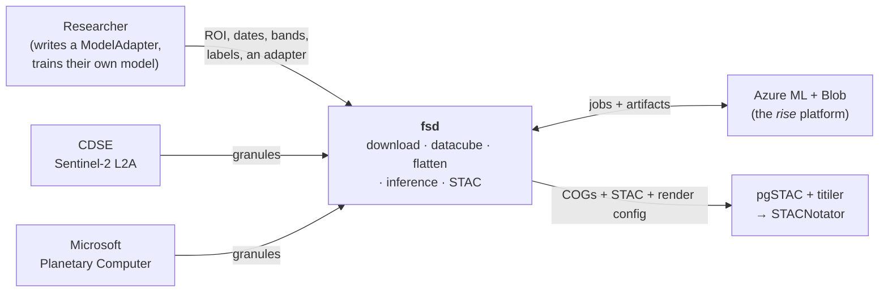
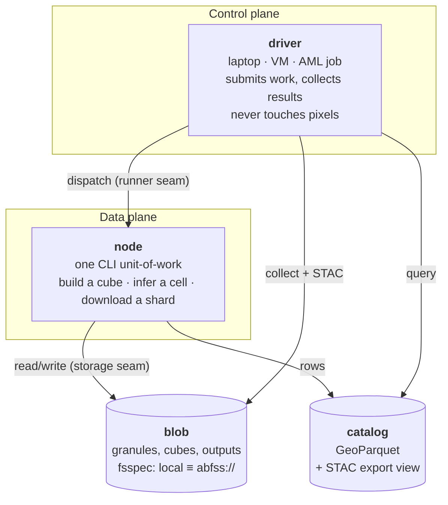
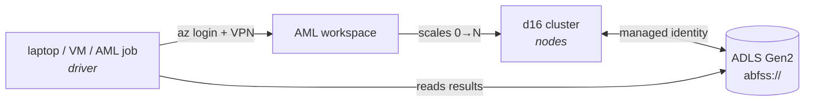

# ARCHITECTURE

The code map. **Where things live, what must stay true, and what runs where.**

Read this before changing code. For *why* a decision was made, see [`docs/adr/`](docs/adr/); for
where fsd is going, [`ROADMAP.md`](ROADMAP.md); for what a term means, [`CONTEXT.md`](CONTEXT.md).

Modules and types are **named, not deep-linked** — symbol-search beats a line number that rots.

---

## 1. Context — what fsd is, and what it is not

**fsd never trains a model.** Training is permanently the user's side of the line — fsd produces
training arrays and consumes a bundled adapter. It also builds **no dashboard**: it emits standard
STAC + COGs, and stock infrastructure serves them.

## 2. Containers — the four runtime pieces

C4's "container" means *a separately runnable thing* — [its own docs say **"Not
Docker!"**](https://c4model.com/diagrams/container). fsd's containers are therefore these, and
emphatically **not** the AML Docker environments (those are packaging for the node).

**The driver/node split is the single most important thing in this document.** The driver is a thin,
portable, authenticated job submitter — laptop (VPN + `az login`), a VM, an AML job, later a
Function. The data plane is heavy and **must be cloud-colocated**: compute next to storage.

Keeping the driver thin is *why* all three driver locations are cheap to support — and its cost when
violated is measured: [`docs/findings/cloud-overhead.md`](docs/findings/cloud-overhead.md) shows a
per-output-unit collect loop running on the operator's laptop over VPN was **35 % of a 2067 s run**.

## 3. Code map

| module | responsibility |
|---|---|
| `fsd/api.py` | **the public verbs** — `download`, `create_training_data`, `flatten_training_data`, `run_inference`, `deploy`. Preflight lives here: fail cheap, before any spend. |
| `fsd/sources/` | `cdse.py`, `mpc.py` — discover + fetch granules. `_s2_radiometry.py` derives offset/scale from the processing baseline. `download_cli.py` is the safe shell runner. |
| `fsd/catalog/` | `catalog.py` = `TileCatalog`, the GeoParquet query format. `stac.py` = an **additive export view**. `declaration.py` carries radiometry through. |
| `fsd/datacube/` | `builder.py` merges granules into one cube per geometry; `ops.py` array transforms; `flatten.py` the reduce into training arrays. |
| `fsd/bands/` | band math on the 5-D contract. |
| `fsd/raster/` | rasterio primitives: `cog.py` (COG conversion, remote-dst branch), `images.py`. **The one place GDAL/VSI opens paths directly.** |
| `fsd/grid.py` | `roi_to_s2_grids` — an ROI becomes S2 grid cells, one cell = one work unit. |
| `fsd/model/` | `adapter.py` the `ModelAdapter` contract, `bundle.py` packaging, `engine.py` inference, `features.py`. |
| `fsd/workflows/` | `task.py` / `infer_task.py` / `shard.py` = the CLI units-of-work. `runners.py` = the runner seam (local Snakemake, AML). |
| `fsd/storage/` | `fs.py` the fsspec seam every module uses; `azure.py` the `az://` URL form. |

**Key types:** `TileCatalog` · `ModelAdapter` / `BaseModelAdapter` · `TrainingData` ·
`InferenceResult` · `Output` · `PreflightError`.

**Two datacube types, one builder:** training cubes (one per labelled field, tiny — a median cube is
14 × 15 px) and inference cubes (one per grid cell, large — 597 × 554 px). Same code, opposite
economics; see [`docs/findings/workload-regimes.md`](docs/findings/workload-regimes.md).

## 4. Invariants

Important invariants are **an absence of something** — that is what makes them checkable:

1. **No module opens a path outside `fsd.storage`.** The documented exception is raster pixel reads,
   which go through rasterio/GDAL VSI. This is what makes local ≡ `abfss://` a config change.
2. **No direct `boto3`.** S3 transport is `s3fs` with any `endpoint_url`; a tile download is
   `storage.transfer(src, dst)`.
3. **The unit-of-work never knows how it was scheduled.** `workflows/task.py` reads its inputs and
   writes its artifact; it cannot tell Snakemake from AML. This is what makes a new backend a
   dispatch swap, not a pipeline rewrite.
4. **fsd never trains a model.** It produces training arrays and consumes a bundle.
5. **fsd builds no dashboard.** It emits STAC + COGs + a render config; stock pgSTAC/titiler serves.
6. **Ingest stores raw DN.** Radiometry is *declared* as metadata, never baked into pixels.
7. **An ROI is one region, not a label set.** One cell = one row = one work unit; ids are unique.
   Violating this cost two failed cluster runs — issue #58, spec 21 D-GRID-1.
8. **Verbs never auto-fetch.** Missing imagery yields an actionable plan, not a surprise download.

**Conventions that go with them:** raster ops take and return `(data, profile)` so they chain;
band math uses the 5-D contract `(samples, timestamps, height, width, bands)` plus a `band_indices`
dict; nodata is 0; cubes over one start/end/`mosaic_days` share an identical `timestamps` axis
(`T = ceil((end-start)/mosaic_days)`), which `flatten` requires.

## 5. The three modes

| mode | who does what | state |
|---|---|---|
| **A — fully local** | the laptop does everything: download → datacube → flatten → train → inference | works today; the escape hatch for Azure-hesitant colleagues, and it never goes away |
| **B — cloud data + compute, local control and training** | the laptop is a thin remote control: it triggers download/build/flatten in the cloud, then pulls back only the **compact flattened arrays** | proven on the cluster 2026-07-29 |
| **C — fully cloud inference** | register a model + adapter, trigger by ROI + dates; the cloud fans out, runs the model, writes COGs + STAC | proven on the cluster 2026-07-29 |

The "downloading raw data to a laptop defeats the cloud speed-up" worry is really *Mode A data
locality with Mode C speed*, which is incoherent. The resolution is Mode B: **you download the
flattened result, not the raw imagery.**

## 6. Layers — swap a backend without touching the core

- **L0 — core library.** Pure pipeline functions. Cloud-agnostic; never imports Azure.
- **L1 — seams.** Storage (fsspec), runner (Snakemake → AML), control/trigger.
- **L2 — deployment backends.** Local, AML, later others.
- **L3 — project contract.** The user-supplied `ModelAdapter`.
- **L4 — product surfaces.** pip UX, config, hosted titiler/STAC. fsd *produces* the STAC + COG;
  infrastructure *hosts* the tiler.

## 7. Deployment

Every concrete name, id and URL lives in `AZURE_INFRA_PRIVATE.md` at the **workspace root**, never
in this repo — it is public MIT. The variables are named and verifiable in
[`docs/reference/environment.md`](docs/reference/environment.md); fill `env.example.sh` →
`env.local.sh`.

## 8. Contributing

- **Setup:** `python3.11 -m venv .venv && source .venv/bin/activate && pip install -e ".[dev]"`
- **Before you push:** `.venv/bin/python -m pytest -q` and `.venv/bin/ruff check src/ tests/ demos/`
- **Tests are synthetic and offline.** Anything needing credentials, a cluster or human eyes is a
  **run-book** (`runbooks/`, spec 24), not a test.
- **Docs can fail the suite** — `tests/test_docs.py` checks status headers and `AZ_*` parity. Adding
  or renaming an `AZ_*` variable means editing `env.example.sh` and
  `docs/reference/environment.md` in the same change.
- **Design lands as a spec first** (`specs/`), signed off before implementation.
- **Point-in-time documents are never edited after the fact** — specs, run-books, findings, ADRs,
  the progress archive. Supersede them with a new document instead.
- **Open work is GitHub Issues**, not a file. Issue numbers #1–#62 are aligned with the historical
  `TODO #NN` references.
- **Never commit a concrete Azure identifier.** Run `RECIPES.md`'s sweep after any session that
  writes prose about a real run — it has caught three leaks that way.

