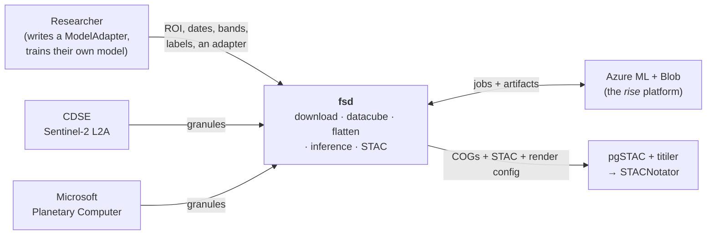
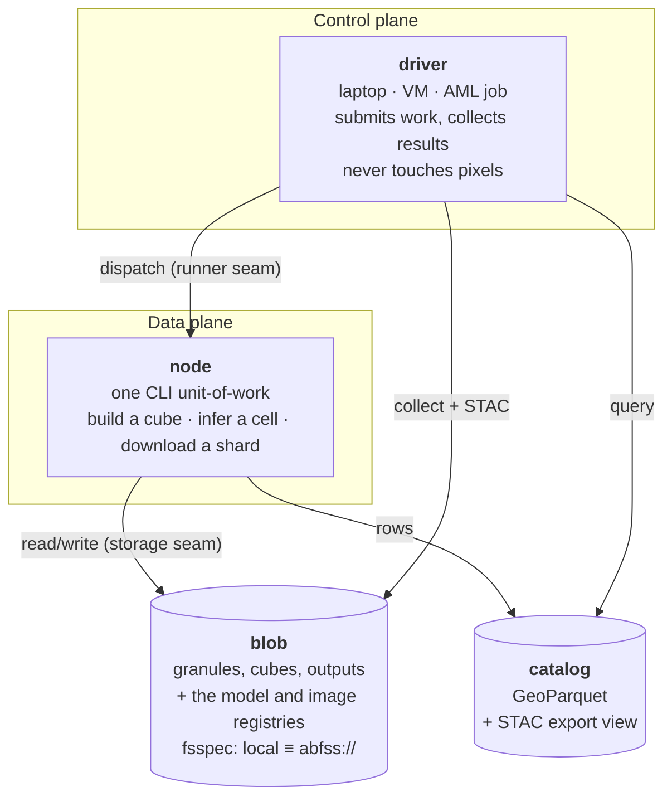
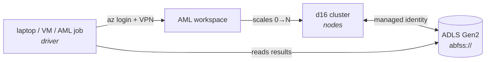

# ARCHITECTURE

The code map. **Where things live, what must stay true, and what runs where.**

Read this before changing code. For *why* a decision was made, see [`docs/adr/`](docs/adr/); for
how the code got this shape — the forks taken and dropped — [`docs/history.md`](docs/history.md);
for where fsd is going, [`ROADMAP.md`](ROADMAP.md); for what a term means,
[`CONTEXT.md`](CONTEXT.md).

Modules and types are **named, not deep-linked** — symbol-search beats a line number that rots.

---

## 1. Context — what fsd is, and what it is not

**fsd never trains a model.** Training is permanently the user's side of the line — fsd produces
training arrays and consumes a bundled adapter. It also builds **no dashboard**: it emits standard
STAC + COGs, and stock infrastructure serves them.

## 2. Containers — the four runtime pieces

C4's "container" means *a separately runnable thing* — [its own docs say **"Not
Docker!"**](https://c4model.com/diagrams/container). fsd's containers are therefore these, and
emphatically **not** the AML Docker environments (those are packaging for the node).

**The driver/node split is the single most important thing in this document.** The driver is a thin,
portable, authenticated job submitter — laptop (VPN + `az login`), a VM, an AML job, later a
Function. The data plane is heavy and **must be cloud-colocated**: compute next to storage.

Keeping the driver thin is *why* all three driver locations are cheap to support — and its cost when
violated is measured: [`docs/findings/cloud-overhead.md`](docs/findings/cloud-overhead.md) shows a
per-output-unit collect loop running on the operator's laptop over VPN was **35 % of a 2067 s run**.
Removing those round-trips took that window from **777 s to 36 s** on a 299-cell run (spec 57).

**Two registries live on blob**, addressed through the same storage seam as everything else: the
**model registry** (a name and a version for a bundle) and the **image registry** (a name and a
version for a resolved image definition). Both are stores, not services — a directory layout plus
an all-or-nothing completion marker, readable by anything that can read a blob. fsd never hard-codes
where they are; the location is an argument, optionally defaulted from user config.

## 3. Code map

| module | responsibility |
|---|---|
| `fsd/api.py` | **the public verbs** — `download`, `create_training_data`, `flatten_training_data`, `run_inference`, `verify_adapter`, `deploy`. Preflight lives here: fail cheap, before any spend. |
| `fsd/sources/` | `cdse.py`, `mpc.py` — discover + fetch granules. `_s2_radiometry.py` derives offset/scale from the processing baseline. `download_cli.py` is the safe shell runner. |
| `fsd/catalog/` | `catalog.py` = `TileCatalog`, the GeoParquet query format. `stac.py` = an **additive export view**; `stac_geoparquet.py` exports it in the form pgSTAC loads. `declaration.py` carries radiometry through. `inspect_cli.py` / `restamp_cli.py` are operator tools. |
| `fsd/datacube/` | `builder.py` merges granules into one cube per geometry; `ops.py` array transforms; `flatten.py` the reduce into training arrays. |
| `fsd/bands/` | band math on the 5-D contract. |
| `fsd/raster/` | rasterio primitives: `cog.py` (COG conversion, remote-dst branch), `images.py`. **The home of the GDAL/VSI exception to invariant 1** — the mosaic path in `api.py` and the COG writer in `model/engine.py` also open rasters directly, and are the only other places that may. |
| `fsd/grid.py` | `roi_to_s2_grids` — an ROI becomes S2 grid cells, one cell = one work unit. |
| `fsd/model/` | `adapter.py` the `ModelAdapter` contract, `bundle.py` packaging (carries the adapter's own source since spec 44), `engine.py` inference, `features.py`. `registry.py` = **a name for a bundle**, on the storage seam. `verify_image.py` answers "does this image actually run this bundle?". |
| `fsd/workflows/` | `task.py` / `infer_task.py` / `infer_only_task.py` / `shard.py` / `infer_shard.py` / `create_datacube.py` / `download.py` / `flatten.py` = the CLI units-of-work. `runners.py` = the runner seam (local Snakemake, AML). `stamp.py` = **the one identity-stamp helper** — "were these artifacts derived from exactly *this* request?", never a modification time. `adapter_smoke.py` is the import-level gate. |
| `fsd/image/` | an AML node image **declared as data**: `definition.py` (a frozen `ImageDefinition` that renders a Dockerfile but never builds one), `digest.py` (resolve every moving reference to a fixed one, then hash), `registry.py` (the versioned store of resolved definitions). |
| `fsd/aml/` | `environment.py` — **the only module in fsd that shells out to `az`**. `ensure_environment` builds a declared image if that digest is not already registered, and reuses it otherwise. Azure coordinates are always arguments; fsd hard-codes none. |
| `fsd/registry/` | `_core.py` — generic version allocation, aliases, and the all-or-nothing completion marker shared in shape by the model and image registries. |
| `fsd/config.py` · `fsd/cli.py` | the user-level config (`~/.config/fsd/config.toml`) and the **`fsd` console script** that writes it — `fsd init`, `fsd config`. Operator-facing: **the library itself never reads the config file**, it takes locations as arguments. |
| `fsd/progress.py` | one shared throttled ticker (rate + elapsed + ETA). Every driver-side loop that can run for minutes prints through it rather than growing a second copy. |
| `fsd/secrets.py` | a thin Key Vault read, authenticated by the same managed identity as blob. |
| `fsd/storage/` | `fs.py` the fsspec seam every module uses; `azure.py` the `az://` URL form. |

**Key types:** `TileCatalog` · `ModelAdapter` / `BaseModelAdapter` · `TrainingData` ·
`InferenceResult` · `Output` · `PreflightError` · `ImageDefinition` · `EnsureResult` (which carries
**both** versions, because AML versions *assets* while the registry versions *definitions* — they
are not the same number, and assuming they were cost a real run).

**Two datacube types, one builder:** training cubes (one per labelled field, tiny — a median cube is
14 × 15 px) and inference cubes (one per grid cell, large — 597 × 554 px). Same code, opposite
economics; see [`docs/findings/workload-regimes.md`](docs/findings/workload-regimes.md).

## 4. Invariants

Important invariants are **an absence of something** — that is what makes them checkable:

1. **No module reaches a *remote* path outside `fsd.storage`.** This is what makes local ≡
   `abfss://` a config change. Two documented exceptions, both narrow:
   - **raster pixel reads**, which go through rasterio/GDAL VSI (`raster/`, plus the mosaic path in
     `api.py`);
   - **node-local scratch and CLI-local files** — bare `open()` on a path that is always on the
     local disk (a staged bundle, a `_result.json`, a Snakemake sentinel, a scratch GeoTIFF).
     `api.py`'s scratch opens carry an inline comment saying so.

   The line to hold is therefore: **a bare open is only ever legal on a path that cannot be
   remote.** Anything that could be a URL goes through `fsd.storage`.
2. **No direct `boto3`.** S3 transport is `s3fs` with any `endpoint_url`; a tile download is
   `storage.transfer(src, dst)`.
3. **The unit-of-work never knows how it was scheduled.** `workflows/task.py` reads its inputs and
   writes its artifact; it cannot tell Snakemake from AML. This is what makes a new backend a
   dispatch swap, not a pipeline rewrite.
4. **fsd never trains a model.** It produces training arrays and consumes a bundle.
5. **fsd builds no dashboard.** It emits STAC + COGs + a render config; stock pgSTAC/titiler serves.
6. **Ingest stores raw DN.** Radiometry is *declared* as metadata, never baked into pixels.
7. **An ROI is one region, not a label set.** One cell = one row = one work unit; ids are unique.
   Violating this cost two failed cluster runs — issue #58, spec 21 D-GRID-1.
8. **Verbs never auto-fetch.** Missing imagery yields an actionable plan, not a surprise download.
9. **No skip decision reads a modification time.** Two unsynchronised clocks make a timestamp
   meaningless between a driver and a node, and a blob's `Last-Modified` is read-only — it cannot
   carry *when this content was produced* across a copy at all. Asserted directly rather than
   trusted: `test_no_mtime_read_in_build_skip_logic` and `test_no_mtime_read_in_flatten_skip_logic`
   scan the skip logic's own source for `getmtime` / `st_mtime` / `os.stat`.

   What replaces it is **identity** — a stamp recording the request that produced an artifact
   (`workflows/stamp.py`), used for the flatten skip and for reusing a landed cube. **Presence is
   still what the cube-build skip keys on**, deliberately and with a known limit: a *truncated*
   cube passes a presence test, which is why downloads and cube writes being atomic is the named
   prerequisite (#74, #76) rather than a size comparison bolted on now.

   The failure mode all of this exists to prevent is **existence standing in for identity**, and it
   has cost real runs: a resume that re-inferred a *different* ROI (#66), and a cube reused as
   "already landed" and then stamped with the wrong request's identity.

**Conventions that go with them:** raster ops take and return `(data, profile)` so they chain;
band math uses the 5-D contract `(samples, timestamps, height, width, bands)` plus a `band_indices`
dict; nodata is 0; cubes over one start/end/`mosaic_days` share an identical `timestamps` axis
(`T = ceil((end-start)/mosaic_days)`), which `flatten` requires.

## 5. The three modes

| mode | who does what | state |
|---|---|---|
| **A — fully local** | the laptop does everything: download → datacube → flatten → train → inference | works today; the escape hatch for Azure-hesitant colleagues, and it never goes away |
| **B — cloud data + compute, local control and training** | the laptop is a thin remote control: it triggers download/build/flatten in the cloud, then pulls back only the **compact flattened arrays** | proven on the cluster 2026-07-29; re-run 2026-09-02 from a separate repo with fsd installed as a dependency |
| **C — fully cloud inference** | register a model + adapter, trigger by ROI + dates; the cloud fans out, runs the model, writes COGs + STAC | proven on the cluster 2026-07-29; re-run 2026-09-02 from a separate repo with fsd installed as a dependency |

The "downloading raw data to a laptop defeats the cloud speed-up" worry is really *Mode A data
locality with Mode C speed*, which is incoherent. The resolution is Mode B: **you download the
flattened result, not the raw imagery.**

## 6. Layers — swap a backend without touching the core

- **L0 — core library.** Pure pipeline functions. Cloud-agnostic; never imports Azure.
- **L1 — seams.** Storage (fsspec), runner (Snakemake → AML), control/trigger.
- **L2 — deployment backends.** Local, AML, later others.
- **L3 — project contract.** The user-supplied `ModelAdapter`.
- **L4 — product surfaces.** pip UX, config, hosted titiler/STAC. fsd *produces* the STAC + COG;
  infrastructure *hosts* the tiler.

## 7. Deployment

Every concrete name, id and URL lives in `AZURE_INFRA_PRIVATE.md` at the **workspace root**, never
in this repo — it is public MIT. The variables are named and verifiable in
[`docs/reference/environment.md`](docs/reference/environment.md). Bootstrap with **`fsd init`**,
which writes `~/.config/fsd/config.toml` (spec 54); `AZ_*` environment variables still override it
per shell, and `fsd config` shows the resolved value and where each one came from.

## 8. Contributing

- **Setup:** `python3.11 -m venv .venv && source .venv/bin/activate && pip install -e ".[dev]"`
- **Before you push:** `.venv/bin/python -m pytest -q` and `.venv/bin/ruff check src/ tests/ demos/`
- **Tests are synthetic and offline.** Anything needing credentials, a cluster or human eyes is a
  **run-book** (`runbooks/`, spec 24), not a test.
- **Docs can fail the suite** — `tests/test_docs.py` checks point-in-time status headers, config-key
  parity, that every relative link in the maintained docs resolves, and that every `fsd.<verb>(…)`
  the README calls really binds to the live signature. Adding or renaming a config key means editing
  `fsd/config.py` and `docs/reference/environment.md` in the same change.
- **Design lands as a spec first** (`specs/`), signed off before implementation.
- **Point-in-time documents are never edited after the fact** — specs, run-books, findings, ADRs,
  the progress archive. Supersede them with a new document instead.
- **Open work is GitHub Issues**, not a file. Issue numbers #1–#62 are aligned with the historical
  `TODO #NN` references.
- **Never commit a concrete Azure identifier.** Run `RECIPES.md`'s sweep after any session that
  writes prose about a real run — it has caught **four** leaks that way, the most recent being a
  write-up that spelled the identifier out while explaining that it had been scrubbed. Describe the
  identifier, never spell it.

