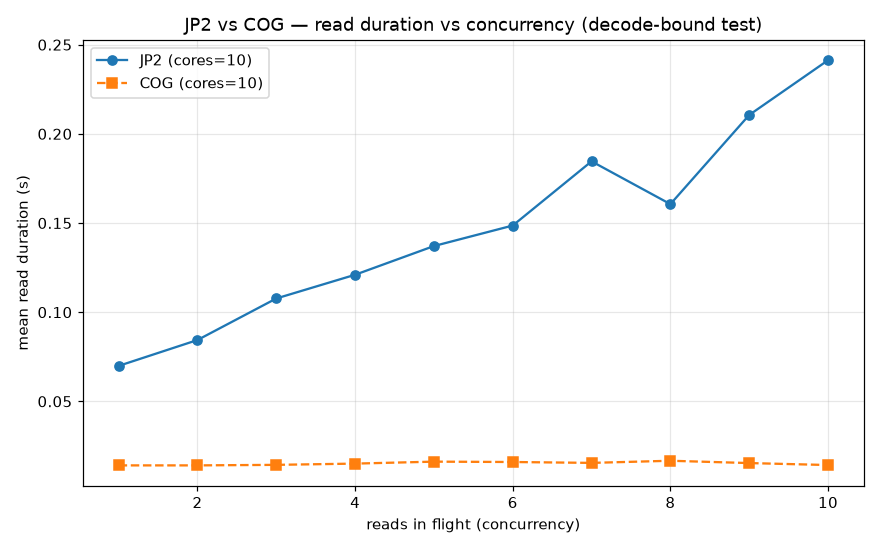

# COG vs JP2 — storage-vs-time (spec 13)
_generated 2026-07-04T12:53:03.788075Z_
Same grids, window and `cores` sweep; the two runs differ **only** in tile format (native CDSE JP2 vs base COG = DEFLATE+PREDICTOR=2, tiled, no overviews). `speedup` = JP2 / COG (>1 = COG faster).

## Time
| cores | JP2 wall (s) | COG wall (s) | wall × | JP2 load | COG load | load × | JP2 mean load/grid | COG mean load/grid |
|---|---|---|---|---|---|---|---|---|
| 1 | 582.2 | 369.15 | 1.58× | 257.1 | 71.1 | 3.62× | 2.57 | 0.71 |
| 2 | 337.45 | 191.65 | 1.76× | 316.2 | 73.3 | 4.31× | 3.16 | 0.73 |
| 4 | 243.25 | 102.92 | 2.36× | 442.9 | 75.9 | 5.84× | 4.43 | 0.76 |
| 6 | 219.22 | 74.65 | 2.94× | 599.7 | 79.1 | 7.58× | 6.0 | 0.79 |
| 8 | 208.8 | 60.89 | 3.43× | 748.9 | 83.9 | 8.93× | 7.49 | 0.84 |
| 10 | 206.13 | 59.5 | 3.46× | 936.5 | 99.4 | 9.42× | 9.37 | 0.99 |

## Storage
| | JP2 (GiB) | base COG (GiB) | ratio | +overviews (GiB, est) |
|---|---|---|---|---|
| total | 32.13 | 39.37 | 1.225× | 54.49 |

## Verdict — space vs time
- **Time:** COG is up to **3.46× faster wall** (cores=10); `load_images` up to **9.42× faster**.
- **Decode-bound test:** JP2 read duration rose 3.45× with concurrency vs COG 1.01× — COG's curve is **flatter**. A flatter, lower COG curve = the JP2 wavelet *decode* was the bottleneck.
- **Space:** COG costs **1.225× the JP2 storage** (+23%); extrapolated to a year ≈ 118.11 GiB vs 96.38 GiB JP2. Overviews (tiling only) would add ~38.4%.

_The team's call: is the wall/read speedup worth the extra disk?_
