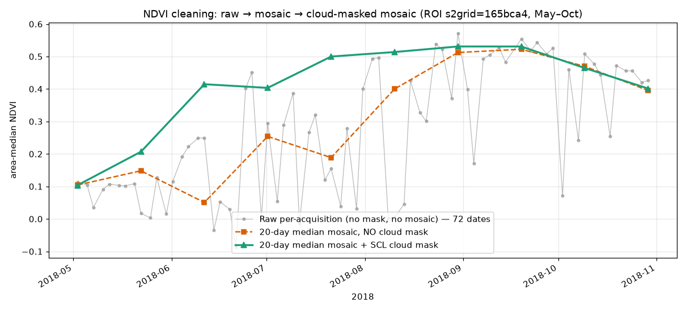
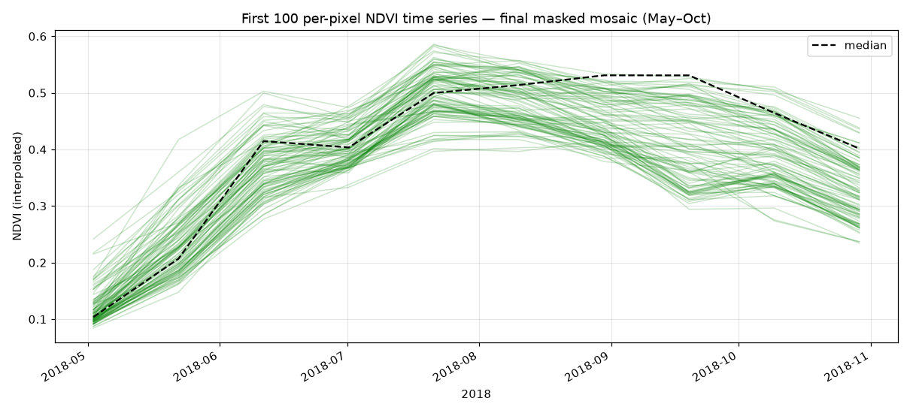
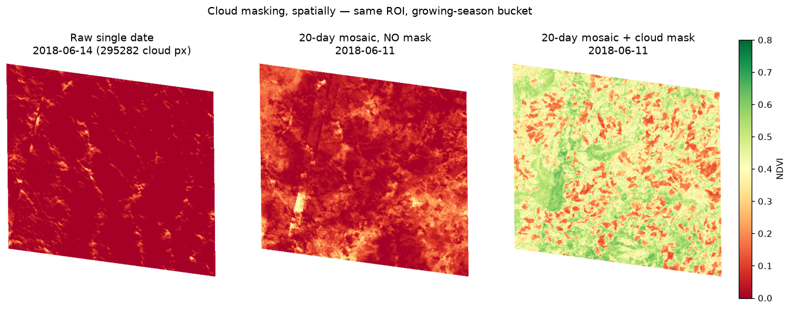

# Datacube benchmark — 1 year, Ethiopia multi-CRS ROI

Heavy test of `fsd.datacube.builder.build_datacube` on a **full year (2018)** of real,
locally-downloaded Sentinel-2 L2A tiles, plus an **NDVI correctness check** that makes
the cloud-mask + median-mosaic effect visible. Two goals:

1. **How fast / how heavy** is per-geometry datacube creation at realistic scale?
2. **Is the output correct?** — an NDVI time series should trace a believable vegetation
   phenology, and cloud masking should measurably clean it.

Reproduce: `benchmarks/datacube_year_ethiopia.py` (build + arrays + stats) then
`benchmarks/datacube_year_ethiopia_plots.py` (figures). Raw stats:
`benchmarks/datacube_year_ethiopia_stats.json`.

## Configuration
| | |
|---|---|
| ROI | `shapefiles/s2grid=165bca4.geojson` (Ethiopia, straddles 36°E) |
| Window | 2018-01-01 → 2019-01-01 (full year) |
| Bands | `B04, B08, B8A, SCL` (B08 = 10 m reference; B8A native 20 m) |
| Source | `satellite_benchmark/` catalog (579 tiles, both EPSG:32636 & 32637) |
| mosaic_days | 20 · SCL mask classes `[0,1,3,7,8,9,10]` |
| Parallelism | `njobs_load=4`, `njobs=4` |
| Machine | Apple Silicon, 10 cores, macOS 15.6 |

## Performance

One `build_datacube` call over the year (single geometry, in-memory):

| Phase | Cold cache (s) | Warm cache (s) |
|---|--:|--:|
| catalog filter + flatten + missing-check | 1.0 | 0.4 |
| **load_images** (crop 2,316 band files to ROI) | **174.9** | **49.2** |
| reference profile (merge 579 B08) | 39.7 | 7.1 |
| resample 2,316 images to reference grid | 8.9 | 4.1 |
| stack → (t,H,W,b) | 0.3 | 0.2 |
| ops: SCL mask → drop → median mosaic | — | ~5 |
| **total** | **238** | **72** |
| peak RSS | 2.7 GB | ~4 GB |

**Reading this:**
- **Disk I/O dominates.** `load_images` (decoding + windowed-cropping 2,316 JP2 files)
  is 70–75% of wall time. The cold run (first read from disk) is **238 s**; a warm run
  (OS file cache hot) is **72 s** — a ~3.3× swing that is *entirely* I/O, not compute.
  This is the number to keep in mind for Azure Batch: **datacube cost is dominated by
  reading tiles**, so tile locality / caching / COG range-reads (TODO #14) matter more
  than CPU.
- `reference_profile` is a surprising second (7–40 s): it `rasterio.merge`s all 579 B08
  images just to derive the output grid — more work than strictly needed (candidate
  optimisation: derive the grid from bounds without merging pixels).
- Actual array work (stack, mask, mosaic) is trivial (<6 s) — numba mosaic + numpy.
- Peak memory ~4 GB for a small ROI over a year; scales with `H×W×n_acquisitions`.

## Output
`datacube.npy` `(19, 554, 533, 3)` uint16 + `metadata.pickle.npy`:
- **144 acquisitions → 19 median-mosaic timestamps** (20-day windows), `SCL` dropped.
- `dst_crs = EPSG:32636` (chosen in-situ by max mean area contribution); both UTM zones
  merged. **244,629 / 295,282 pixels (83%)** carry valid data.

## NDVI validation

### 1. Temporal cleaning — raw → mosaic → cloud-masked mosaic
Area-median NDVI over the ROI, growing season (May–Oct).

- **Raw per-acquisition** (grey, 72 dates): violently noisy, dipping **below 0** — clouds
  crush NDVI on overcast days (Ethiopian *kiremt* rains, Jun–Sep).
- **Mosaic, no cloud mask** (orange): smoother but **biased low** all through the cloudy
  growing season — cloud pixels drag the per-bucket median down (e.g. mid-June ~0.05).
- **Mosaic + SCL cloud mask** (green): a clean phenology arc — green-up from ~0.1 (May)
  to a **~0.53 peak in September**, then senescence. The green–orange gap in Jun–Aug is
  the cloud-masking payoff; they converge Sep–Oct as skies clear.

This is the headline correctness result: the pipeline turns unusable raw revisits into a
believable crop/vegetation growth curve.

### 2. Per-pixel time series — final masked mosaic
First 100 per-pixel NDVI series (interpolated) + median, demo `plot_ndvi_data` style.

Pixels move together through the season (coherent phenology) with a spread that reflects
real land-cover heterogeneity in the ROI — no scattered cloud spikes left.

### 3. Cloud masking, spatially
The season bucket where masking mattered most (**2018-06-11**, +0.364 NDVI gain); raw
panel is a fully-clouded acquisition inside it (**2018-06-14**, every pixel flagged cloud).

- **Raw single date**: all red — one overcast overpass is worthless on its own.
- **Mosaic, no mask**: recovers terrain structure but stays cloud-dragged (~0.1–0.3),
  with visible cloud-shadow streaks.
- **Mosaic + mask**: real vegetation returns (green 0.4–0.6) with genuine bare patches —
  the clear-sky signal, reconstructed.

## Takeaways
- ✅ `build_datacube` handles a full year of real multi-CRS data in ~1–4 min per ROI
  (I/O-bound), ~4 GB peak — comfortable for per-geometry Batch tasks.
- ✅ Output is **correct**: masked-mosaic NDVI traces real phenology; masking lifts
  growing-season NDVI by up to ~0.36 and removes sub-zero cloud noise.
- 📌 **Optimisation leads** (deferred): I/O dominates → COG range-reads + tile locality
  (TODO #14); `reference_profile` merges pixels it doesn't need (grid-from-bounds);
  chunked `zarr` artifact for partial reads at scale (TODO #13).
