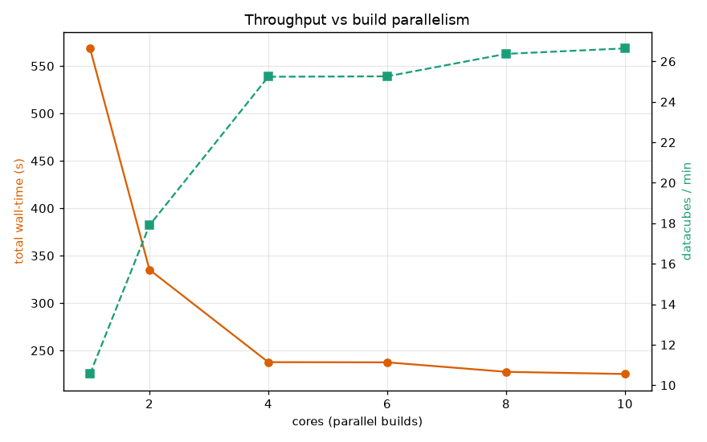
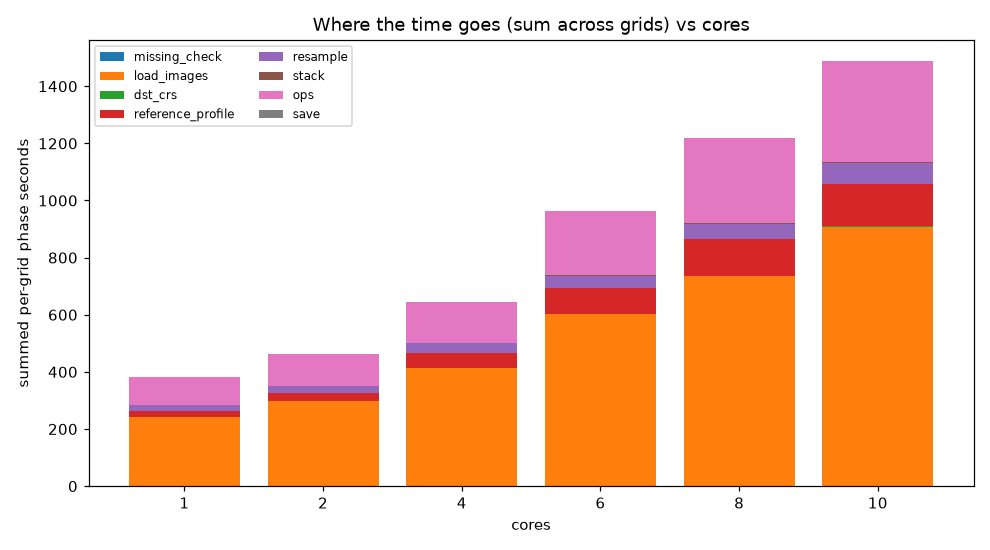
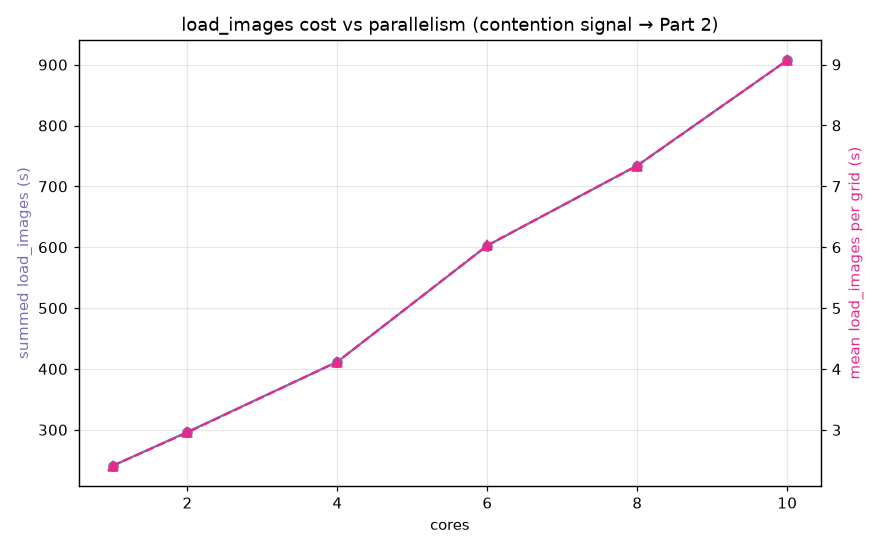
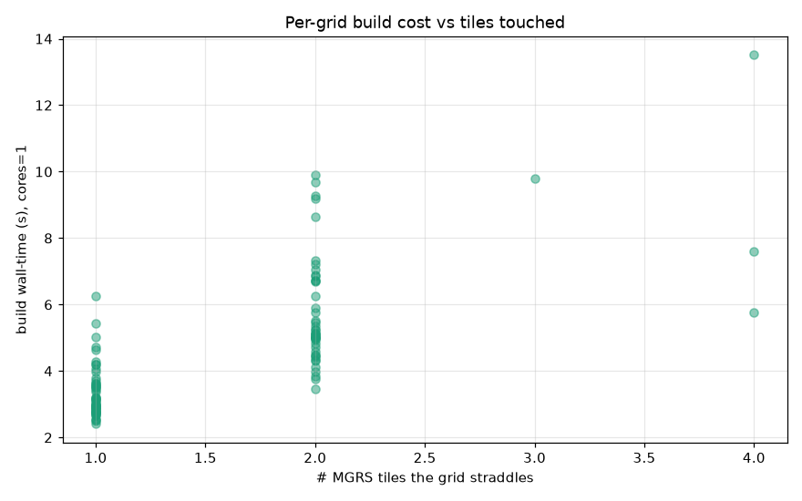

# Datacube throughput benchmark — Part 1 (parallelism sweep)
_Spec 11 · generated 2026-07-03T17:32:42.352653Z_
**Reusable baseline** — re-run `python -m benchmarks.datacube_throughput_sweep` after any speedup and diff against `datacube_throughput_stats.json`.
## Config
- machine: `macOS-15.6.1-arm64-arm-64bit`, 10 logical CPUs
- grids: `100_random_grids.geojson` (n=100 with tiles), catalog `satellite_benchmark` (579 tile-rows)
- window: 2018-06-01 → 2018-07-10, bands ['B04', 'B08', 'B8A', 'SCL'], mosaic_days=20
- cores swept: [1, 2, 4, 6, 8, 10], repeats=1
## Grid characterization (static — potential shared reads)
- MGRS tiles covered: **4**; shared by >1 grid: **4**; max grids on one tile: **48**
- tiles-per-grid distribution: `{'1': 51, '2': 45, '3': 1, '4': 3}` (1 = grid inside a single tile → no cross-tile merge)
- hottest tiles (grids sharing them): `{'36PZT': 48, '37PBN': 43, '36PZU': 33, '37PBP': 32}`
## Throughput vs parallelism
| cores | total (s) | cubes/min | speedup | efficiency | mean load/grid (s) | load_images frac |
|---|---|---|---|---|---|---|
| 1 | 568.55 | 10.55 | 1.0× | 1.0 | 2.41 | 0.627 |
| 2 | 335.18 | 17.9 | 1.7× | 0.85 | 2.96 | 0.642 |
| 4 | 237.7 | 25.24 | 2.39× | 0.6 | 4.12 | 0.637 |
| 6 | 237.52 | 25.26 | 2.39× | 0.4 | 6.03 | 0.626 |
| 8 | 227.5 | 26.37 | 2.5× | 0.31 | 7.34 | 0.603 |
| 10 | 225.21 | 26.64 | 2.52× | 0.25 | 9.07 | 0.61 |

**Best total wall: cores=10** (225.21s, 26.64 cubes/min) — but throughput **plateaus at the knee cores=4** (237.7s): beyond it each extra process buys <5% total while per-build `load_images` keeps rising (efficiency 1.0→0.25). **Recommended ≈ 4 parallel builds** on this machine; the real win is cutting read contention (Parts 2–3), not more processes.

## Where the time goes
Summed per-grid phase seconds at each parallelism. If `load_images` swells with `cores` while other phases stay flat, that is the read-contention signal Part 2 (spec 12) will instrument per-read.

Mean per-grid `load_images` went 2.41s (cores=1) → 9.07s (cores=10) — a 3.76× slowdown.
## Per-grid cost vs tiles touched

## Caveats
- **Cache: measured, not forced** (spec 11). Runs are warm-as-is; re-running the same grids across settings can warm shared file blocks, though the grids read mostly-disjoint windows so reuse is limited. Part 2's per-read timings disentangle cache vs contention.
- Per-grid `wall_seconds` = `done.txt − start.txt` (excludes jitter, which is off here). Per-phase seconds come from the builder `timings.json` sidecar.
