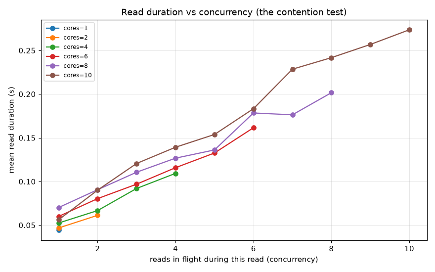
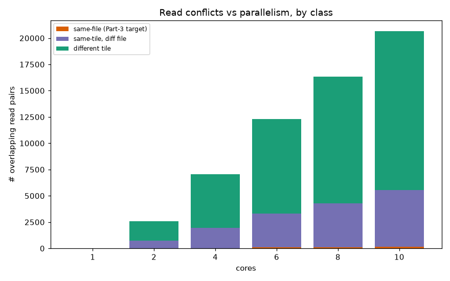
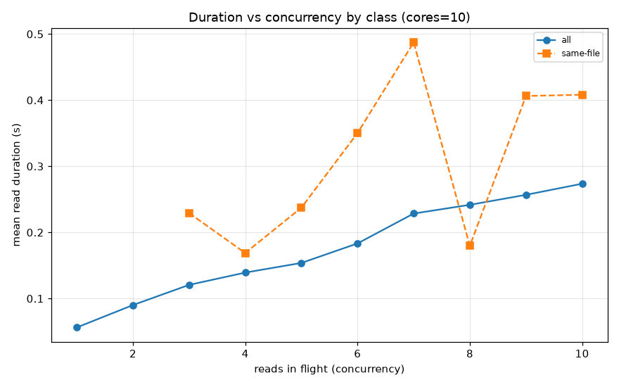
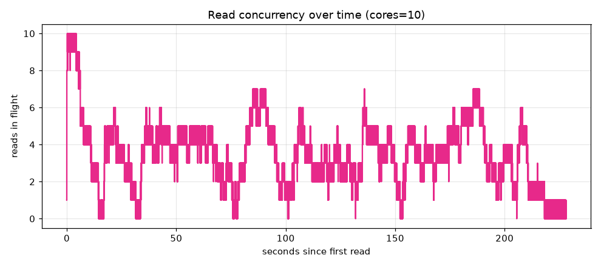

# Datacube throughput benchmark — Part 1 (parallelism sweep)
_Spec 11 · generated 2026-07-04T07:20:47.619952Z_
**Reusable baseline** — re-run `python -m benchmarks.datacube_throughput_sweep` after any speedup and diff against `datacube_throughput_stats.json`.
## Config
- machine: `macOS-15.6.1-arm64-arm-64bit`, 10 logical CPUs
- grids: `100_random_grids.geojson` (n=100 with tiles), catalog `satellite_benchmark` (579 tile-rows)
- window: 2018-06-01 → 2018-07-10, bands ['B04', 'B08', 'B8A', 'SCL'], mosaic_days=20
- cores swept: [1, 2, 4, 6, 8, 10], repeats=1
## Grid characterization (static — potential shared reads)
- MGRS tiles covered: **4**; shared by >1 grid: **4**; max grids on one tile: **48**
- tiles-per-grid distribution: `{'1': 51, '2': 45, '3': 1, '4': 3}` (1 = grid inside a single tile → no cross-tile merge)
- hottest tiles (grids sharing them): `{'36PZT': 48, '37PBN': 43, '36PZU': 33, '37PBP': 32}`
## Throughput vs parallelism
| cores | total (s) | cubes/min | speedup | efficiency | mean load/grid (s) | load_images frac |
|---|---|---|---|---|---|---|
| 1 | 679.74 | 8.83 | 1.0× | 1.0 | 2.79 | 0.612 |
| 2 | 386.75 | 15.51 | 1.76× | 0.88 | 3.33 | 0.631 |
| 4 | 265.39 | 22.61 | 2.56× | 0.64 | 4.57 | 0.632 |
| 6 | 242.4 | 24.75 | 2.8× | 0.47 | 6.13 | 0.626 |
| 8 | 235.36 | 25.49 | 2.89× | 0.36 | 7.54 | 0.603 |
| 10 | 237.43 | 25.27 | 2.86× | 0.29 | 9.12 | 0.6 |

**Best total wall: cores=8** (235.36s, 25.49 cubes/min) — but throughput **plateaus at the knee cores=6** (242.4s): beyond it each extra process buys <5% total while per-build `load_images` keeps rising (efficiency 1.0→0.29). **Recommended ≈ 6 parallel builds** on this machine; the real win is cutting read contention (Parts 2–3), not more processes.

## Where the time goes
Summed per-grid phase seconds at each parallelism. If `load_images` swells with `cores` while other phases stay flat, that is the read-contention signal Part 2 (spec 12) will instrument per-read.

Mean per-grid `load_images` went 2.79s (cores=1) → 9.12s (cores=10) — a 3.27× slowdown.
## Per-grid cost vs tiles touched

## Read contention (Part 2 — per-read instrumentation)
Every windowed read is logged with wall-clock start/end (spec 12). A **conflict** = a pair of reads from *different grids* whose intervals overlap. Classes: **same-file** = identical `filepath` (same product & band) — the *simultaneous same-file* contention Part-3 tile-splitting was meant to remove; **same-tile** = same MGRS tile, different file; **diff-tile** = different tile. `max concur` = peak reads in flight at once (bounded by `cores`).
| cores | reads | conflicts | same-file | same-tile | diff-tile | max concur | mean concur | mean read (s) |
|---|---|---|---|---|---|---|---|---|
| 1 | 6284 | 0 | 0 | 0 | 0 | 1 | 1.0 | 0.0443 |
| 2 | 6284 | 2588 | 21 | 714 | 1853 | 2 | 1.42 | 0.0529 |
| 4 | 6284 | 7046 | 23 | 1917 | 5106 | 4 | 2.14 | 0.0726 |
| 6 | 6284 | 12290 | 94 | 3228 | 8968 | 6 | 2.99 | 0.0974 |
| 8 | 6284 | 16338 | 93 | 4179 | 12066 | 8 | 3.64 | 0.1199 |
| 10 | 6284 | 20649 | 141 | 5419 | 15089 | 10 | 4.34 | 0.1451 |

**Verdict (cores=10).** The 'parallel reads block each other' hypothesis is **confirmed**: for the *same* 6284 reads, mean read duration climbs 0.0562s → 0.2736s (4.87×) from concurrency 1 to 10, and every `cores` line collapses onto one duration-vs-concurrency curve — read cost is set by how many reads are in flight, not by the `cores` knob. Total `load_images` work grows 278.8s → 912.5s (3.27×) across the sweep despite identical read counts. This is the signature of a **shared disk-bandwidth ceiling** (fixed bandwidth split N ways → each read ≈N× slower), which is also why total wall-time plateaus past the throughput knee.

**What splits can vs cannot fix.** Conflicts are **only 0.6% same-file** (same-file 372 / same-tile 15457 / diff-tile 43082) — two grids sharing a tile rarely read the *identical file at the same instant*, so **Part-3 tile-splitting aimed at removing same-file *simultaneous* conflicts would touch a negligible slice.** Two caveats keep this from killing Part 3 outright:
- This measures *simultaneous* conflicts, **not redundant total reads** — the same tile bytes still get re-read once per grid across the whole run, which a bandwidth-bound system pays for. **Tile-centric batching** (read a tile's window once, crop to every grid on it) attacks that directly.
- This workload is *scattered grids over shared tiles*; it does **not** cover the *inference* workload (one region → many disjoint sub-grids, each mapping to its own pre-split file), where splitting means smaller reads + no redundancy. Re-scope Part 3 around that, or fold it into tile-centric batching, rather than 'split to avoid same-file locks'.
- **Highest-value levers, given bandwidth is the ceiling:** reduce concurrent bytes (tile-centric read-once-crop-many), cap parallelism at the throughput knee, raise the ceiling (faster / independent disks, per-node storage on Batch), and cut per-read cost (COG + overviews vs windowed JP2 decode).

**Self-check:** per-run `sum_read_seconds` matches the summed `load_images` phase (reads are the only disk I/O in a build) — e.g. above, 911.65s vs 912.5s at cores=10.
## Caveats
- **Cache: measured, not forced** (spec 11). Runs are warm-as-is; re-running the same grids across settings can warm shared file blocks, though the grids read mostly-disjoint windows so reuse is limited. Part 2's per-read timings disentangle cache vs contention.
- Per-grid `wall_seconds` = `done.txt − start.txt` (excludes jitter, which is off here). Per-phase seconds come from the builder `timings.json` sidecar.
