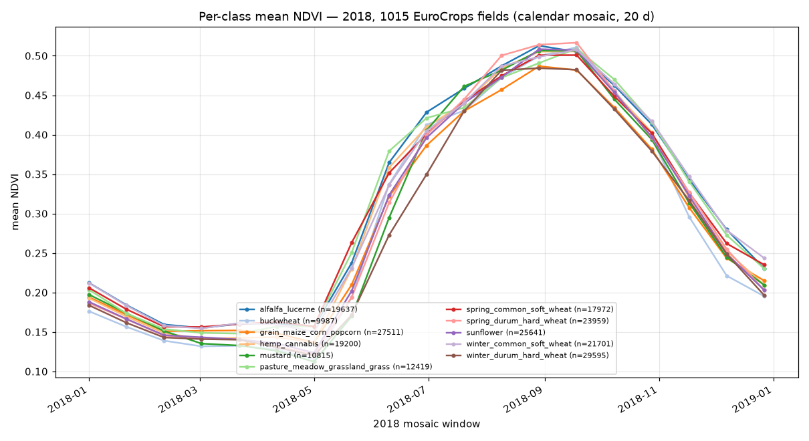

# Full-year datacube benchmark + stats — 1015 EuroCrops fields (2018)

_Generated 2026-07-05 15:37 UTC by `benchmarks/eurocrops_year_report.py`._

Builds one datacube per EuroCrops field over **all of 2018** (`mosaic_days=20` → calendar mosaic, spec 15), then flattens to per-pixel training arrays. Dataset: `austria_eurocrops_sampled_ethiopia_translated.geojson` (id=`fid`, label=`EC_hcat_n`, 11 crop classes) vs the COG archive `satellite_benchmark/` (EPSG:32636 & 32637). Build: `benchmarks/eurocrops_year_build.py`.

## 1. Build benchmark

- **Fields built:** 1015 / 1015 (cores=8, local Snakemake runner).
- **Wall clock:** 15.4 min · **aggregate CPU:** 85.7 min · **effective parallelism:** 5.6×.
- **Per cube:** mean 5.06s, median 4.07s, p95 10.04s, max 21.57s.
- **Throughput:** 66 cubes/min.

**Phase breakdown** (CPU-seconds summed over all cubes):

| phase | seconds | % |
|---|--:|--:|
| load_images | 3748 | 72.9 |
| ops | 829 | 16.1 |
| resample | 293 | 5.7 |
| reference_profile | 226 | 4.4 |
| missing_check | 37 | 0.7 |
| stack | 5 | 0.1 |
| save | 1 | 0.0 |
| dst_crs | 1 | 0.0 |

**`load_images` is 73% of build CPU** — the read/crop of tile windows dominates, confirming the pipeline is **I/O-bound** even on the fast COG archive (consistent with the single-ROI year benchmark). See `eurocrops_year_figures/build_timings.png`.

## 2. Dataset

- **Flattened:** `data.npy (218437, 19, 3)` (pixels × 19 timestamps × 3 bands ['B04', 'B08', 'B8A']), **218,437 labelled pixels** across 11 classes.
- **Cube timestamps:** 19 calendar mosaics (2018-01-01 … 2018-12-27); per-cube n_ts min 19/median 19/max 19.
- **UTM zones (dst_crs):** {'32636': 928, '32637': 87} — multi-zone (coords mixed, TODO #16).
- **Images loaded/cube:** mean 703, max 2304.

**Pixels per class:**

| class | pixels |
|---|--:|
| winter_durum_hard_wheat | 29,595 |
| grain_maize_corn_popcorn | 27,511 |
| sunflower | 25,641 |
| spring_durum_hard_wheat | 23,959 |
| winter_common_soft_wheat | 21,701 |
| alfalfa_lucerne | 19,637 |
| hemp_cannabis | 19,200 |
| spring_common_soft_wheat | 17,972 |
| pasture_meadow_grassland_grass | 12,419 |
| mustard | 10,815 |
| buckwheat | 9,987 |

## 3. Per-class NDVI phenology



Each line is the mean NDVI of one label class across the 2018 mosaic windows. The classes **largely overlap on one clean single-season curve** — dry-season NDVI ~0.14 (Jan–Mar), green-up through mid-year, peak ~0.50 around Aug–Sep, senescence into the dry season. That overlap is expected and correct here: the EuroCrops **labels are Austrian field polygons geometrically translated onto Ethiopia**, so they do not correspond to real ground cover and are *not* meant to separate by crop type. **The value of this run is pipeline validation, not crop separability:** the phenology is physically plausible, the curves are smooth across the 20-day calendar mosaics, and all 1015 cubes share an identical 19-window axis (per-cube n_ts min=median=max=19) across **both UTM zones** — so the multi-tile/multi-zone cubes composite coherently and spec-15 calendar mosaicing holds at scale (this is what makes `flatten` clean). Temporal data availability (cloud gaps) is in `eurocrops_year_figures/coverage.png`.

## Reproduce
```bash
FSD_WRITE_TIMINGS=1 fsd/.venv/bin/python fsd/benchmarks/eurocrops_year_build.py
fsd/.venv/bin/python fsd/benchmarks/eurocrops_year_report.py
```

Cubes + flattened arrays under `tests/outputs/datacube_year/` (gitignored); this report + figures are committed.
