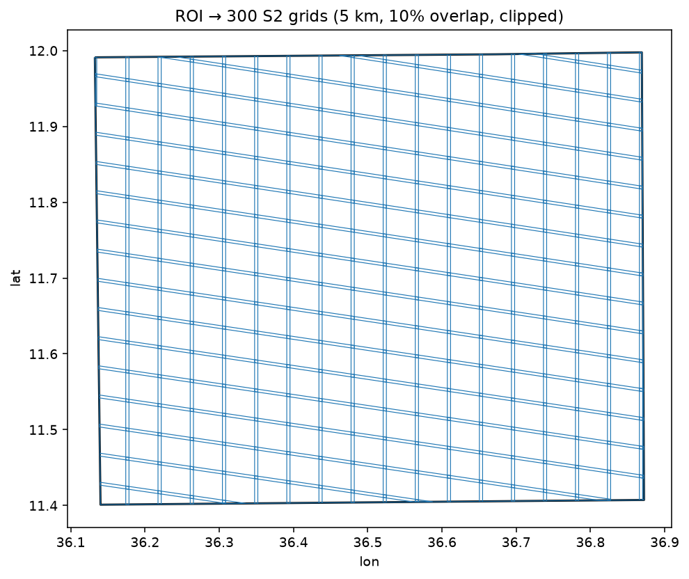
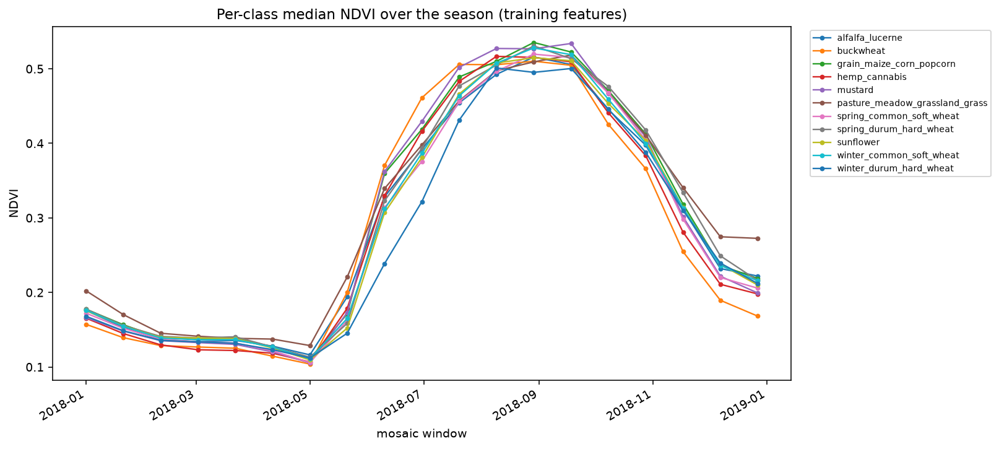
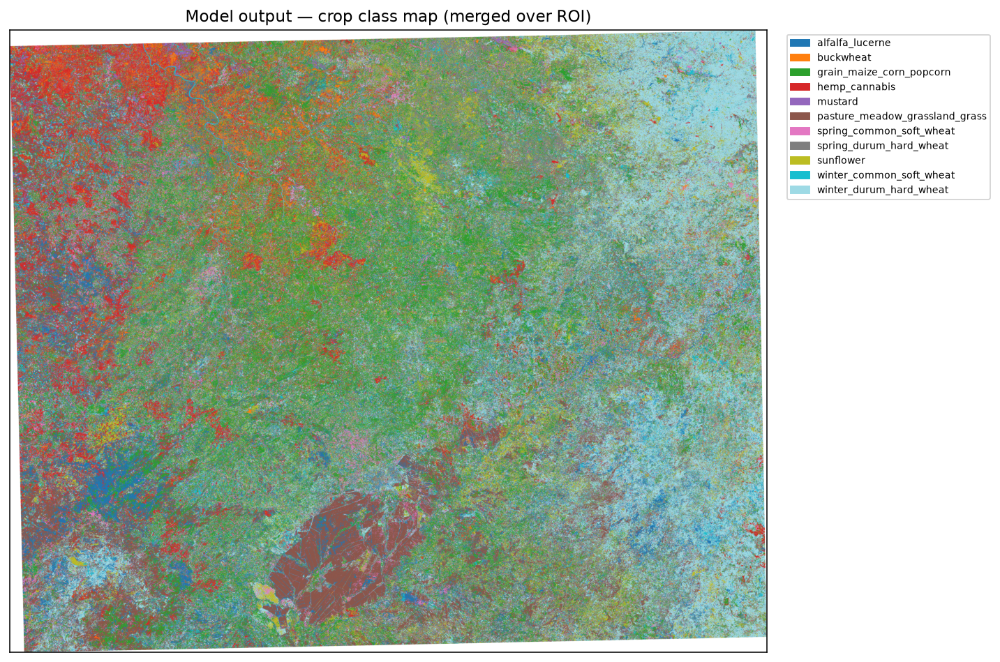

# fsd end-to-end demo — demo_01 + demo_02 + demo_03 (spec 19)

A full **Mode-A** run of the whole product through the fsd verbs, on the **existing Ethiopia
`satellite_benchmark/` data** (no download): ROI→S2 tiling → training data → train → inference →
**COG + STAC + a crop-class map**. It reproduces the three legacy demo notebooks as one flow.

> **⚠️ Model quality is NOT meaningful here.** The labels are Austrian EuroCrops polygons
> *translated onto Ethiopia*, classified from Ethiopian pixels — so the crop map is nonsense as
> agronomy. This run validates the **pipeline** end-to-end and produces QGIS-verifiable
> artifacts. The *real* run (proper Austria imagery, downloaded fresh, then the Ethiopia data
> deleted to free space) comes later once university wifi is available.

## Run it (isolated venv — keeps fsd's `.venv` lean)

sklearn / s2 / matplotlib must **not** pollute fsd's own `.venv`, so use a separate one:

```bash
cd fsd
python3.11 -m venv .venv-modeldeploy
.venv-modeldeploy/bin/pip install -e ".[dev,grid,model-example]"

# quick smoke (4-month window, 33 fields, 6 grids — ~1 min):
.venv-modeldeploy/bin/python demos/e2e_ethiopia.py --fast

# full run (all 1015 fields, whole ROI, full-year T=19 — ~40 min cold on 8 cores):
.venv-modeldeploy/bin/python demos/e2e_ethiopia.py --cores 8
```

Each run prints a **per-step timing breakdown** and writes `tests/outputs/demo_e2e/timings.json`
(see the table under *Full run* below).

Inputs (workspace root):
- training polygons `shapefiles/austria_eurocrops_sampled_ethiopia_translated.geojson`
  (1015 fields, `id=fid`, `label=EC_hcat_n`, 11 classes),
- inference ROI `shapefiles/inference_roi.geojson`,
- imagery `satellite_benchmark/sentinel-2-l2a/catalog.parquet` (2018, B04/B08/B8A/SCL).

## What it does (the 6 steps)

1. **ROI → S2 grids** — `fsd.grid.roi_to_s2_grids(roi, grid_size_km=5, scale_fact=1.1)` (polyfill
   the convex hull at S2 res 11, keep intersecting cells, scale 1.1 for 10 % overlap) then
   `gpd.overlay(grids, roi)` **clip**. Saved as GeoJSON (QGIS) + a PNG.
2. **Training data** — `fsd.create_training_data(adapter=DemoRF(), …)` → per-field datacubes +
   flatten + **`features.npy`** (the adapter's feature transform: mask+interp → NDVI+SAVI →
   drop raw bands). Raw `data.npy` kept too.
3. **Train** — a `RandomForestClassifier` on the features (`demos/adapters.py::DemoRF`;
   band-limited to NDVI+SAVI because the benchmark lacks the 9 bands the full `EuroCropsRF` uses).
4. **Inference datacubes** — `workflows.create_datacube` over the grid cells (no labels).
5. **Inference** — `fsd.run_inference(model=DemoRF, inference_datacubes=…)` → one **COG per grid**
   + a **STAC** catalog. (fsd owns the predict loop; outputs are lossless COGs.)
6. **Plots** — per-class **NDVI timeseries** (training features) + the categorical **crop-class
   map** (merged over the ROI).

### The tile-merge bug this demo caught (spec 20)
The first full run showed **9 of 300 grids as ~nodata holes**, clustered on a horizontal band
(an MGRS tile-**row** boundary at lat ~11.75). Investigation traced it to a **real datacube-builder
bug**, not the demo: `_stack_datacube` kept only **one** tile per `(timestamp, band)`, so any shape
straddling a tile boundary lost the coverage of every other same-acquisition tile (worst grid:
0.6 % valid despite ~80 % raw coverage). Fixed in **spec 20** (nodata-fill merge of all
same-`(timestamp,band)` tiles onto the reference grid) → that grid rebuilt to **82.8 %** valid, and
this run's map has the band filled. This is exactly why the demo exists: a real-data, full-ROI run
surfaces coverage bugs that small synthetic/field tests can't. See `BUGS.md` BUG-002.

### The multi-zone finding (why the map is display-merged)
Although the ROI is geographically east of 36°E (nominally UTM zone 37N), the per-grid datacubes
land in **both** EPSG:32636 **and** 32637 — the builder picks each grid's *dominant* MGRS tile
zone, and S2 zone-36 tiles reach past 36°E. fsd's `run_inference(merge=True)` **rightly refuses**
to `rasterio.merge` across CRS (the single-CRS-merge principle). So the demo uses `merge=False`
and builds the **display** map by reprojecting every output COG to the *dominant* zone (nearest,
categorical-safe) before mosaicking — the same "collapse to one zone" idea, applied to outputs.

## Outputs
- **Figures** (committed, this folder): [`figures/s2_grids.png`](figures/s2_grids.png),
  [`figures/ndvi_timeseries.png`](figures/ndvi_timeseries.png),
  [`figures/crop_map.png`](figures/crop_map.png).
- **QGIS artifacts** (on disk, gitignored under `tests/outputs/demo_e2e/`): the gridded ROI
  `inference_s2_grids.geojson`, per-grid `model_outputs/<id>/output.tif`, the STAC
  `model_outputs/stac/catalog.json`, and the display `model_outputs/merged.tif`.

## Results

### Figures




### Smoke (`--fast`, validated 2026-07-06)
The `--fast` path (4-month window `2018-01-01..2018-05-01`, T=6, 33 fields, 6 grids) ran the whole
chain in ~67 s cold / ~13 s warm (resumable): training features `(6552, 6, 2)` [NDVI, SAVI], RF on
5567 samples × 11 classes, 6 inference cubes → 6 COGs + STAC + a merged map. The 6 grids all fell
in EPSG:32636 (SW corner), so the display merge was single-zone there.

### Full run (post-fix, 2026-07-07, 8 cores, cold — nothing cached)
The figures above are from this run (spec-20 fix applied).

| stage | result |
|---|---|
| ROI → S2 grids | **300** cells (5 km, 10 % overlap), clipped to the ROI |
| training data | **230,567** pixels × T=19 × 2 features [NDVI, SAVI]; raw kept `(230567, 19, 3)` |
| train (RF) | **193,501** samples (NaN pixels dropped), 11 classes |
| inference datacubes | **300** cubes (one per grid) |
| inference | **300** COGs + a STAC catalog (**300** items) |
| zones | outputs in **both EPSG:32636 and 32637** → display-merged to dominant **32636** |
| output coverage | median **82 %** valid per grid; **0** grids < 30 % *(pre-fix: 9)* |
| merged map | `(6708, 8158)` uint8, 18.7 MB, **96 %** valid *(pre-fix: 90 %)* |

**Per-step timing** (`timings.json`, cold run — TOTAL **2446 s ≈ 41 min**):

| step | seconds | share |
|---|--:|--:|
| 1 · ROI → S2 grids | 0.7 | 0 % |
| 2 · training-data build (1015 field cubes + flatten + features) | 960.4 | 39 % |
| 3 · train RandomForest | 34.9 | 1 % |
| 4 · inference datacubes (300 grid cubes) | 958.9 | 39 % |
| 5 · run_inference (300 COGs + STAC + display merge) | 485.0 | 20 % |
| 6 · plots | 6.2 | 0 % |
| **TOTAL** | **2446.0** | **100 %** |

The cost is dominated by the two **datacube-build** stages (78 % combined) — the download-free
part of the pipeline that Azure Batch will fan out; train + inference + plotting are minor.
(A cached re-run skips step 2, finishing in ~20 min.)

**Takeaways:** the whole chain runs end-to-end on real data and yields QGIS-verifiable COGs +
STAC + a crop map. The grid tiling fills the ROI with the expected S2 slant/overlap; the map is
per-pixel salt-and-pepper (a per-pixel RF on a 2-feature toy) and agronomically meaningless
(Ethiopian pixels, Austrian labels) — as intended for a **pipeline** validation. The real payoff:
the first run **caught a genuine datacube-builder coverage bug** (spec 20, above) that single-tile
field/synthetic tests never triggered. The fix recovered the lat-11.75 nodata band (9 dead grids →
0) **and** ~6 % more training pixels (217,914 → 230,567 — a minority of fields straddle boundaries
too). The remaining nuance is the two-UTM-zone split that forces the display merge.

## Notes
- The tiling (`fsd.grid`) is the ROADMAP §4 / P4 groundwork; wiring it into
  `run_inference(roi=…)` (+ download-in-the-loop) is still **P4** — the demo chains
  `grid → create_datacube → run_inference(datacubes)` explicitly.
- Heavy artifacts are gitignored (`tests/outputs/demo_e2e/`); only the small figures here are
  committable. The gridded-ROI GeoJSON is on disk for QGIS.
- Unit coverage: `tests/test_grid.py` (tiling, needs the `[grid]` extra) + `tests/test_model.py`
  (the inference engine, synthetic). This runbook is the real-data + visual gate.
